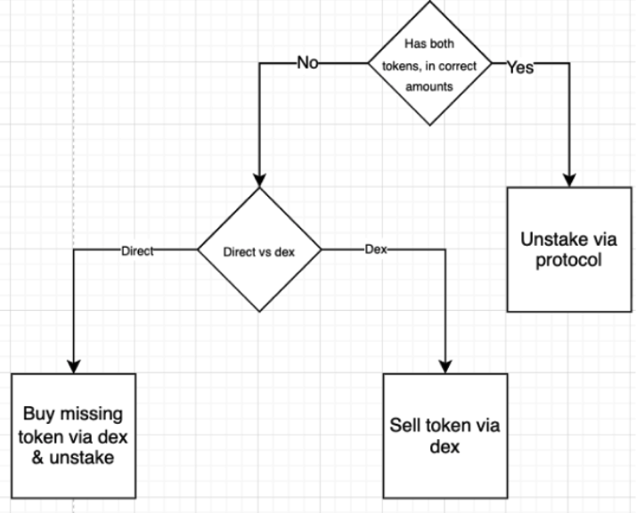

# Protocol Design

## The Objective

The objective of the protocol is to give the staker a choice between earning the “real economic value” (REV) of Solana’s transaction fees, or the inflationary issuance of new SOL tokens. Standard staking yield combines both, and RevTec aims to separate them, and allow users to earn them with much higher capital efficiency. To achieve this, RevTec creates two liquid staking tokens (LSTs): revSOL earns REV from transaction fees, while issSOL earns the issuance of new SOL.

RevTec LSTs closely mimic existing staking token designs. This means that the tokens are valued 1-to-1 with SOL at the protocol’s launch, and gain value over time as yield is accumulated. (As a user, you hold a constant balance of the token, and you’re entitled to more underlying SOL the longer you hold the token for.) This is the same well-understood user experience as other LSTs on Solana, and allows for simple DeFi integrations.

> **Mainnet (v2):** Program ID `59k5msuGtD4oCnkYStGSF7kjeBVynQLNtmYjfg79P7V6` · revSOL `HgEWmCePuhRwrTQMnV7Z4oHiNfjbVZHFXA9XfT9DN3FV` · issSOL `2AvFj4iGTpZnrRo7vLuTMoNNfE7VKAK4SpiJfTnu6Nmq`. Full address list: [Official Links & Mainnet Addresses](../resources/official-links-and-addresses.md#mainnet-addresses-v2).

### Scope: protocol pool vs validator stake

> **Important:** RevTec separates REV and issuance for SOL deposited **through the protocol** (the LSP pool). Stake delegated **directly** to the [RevTec validator](https://stakewiz.com/validator/B1rsc6jv3RsFpkak8qvJN3PfGYSg9E3Uw1joaV1EoiFj) — without minting revSOL or issSOL — earns normal validator rewards on its own. That stake does **not** increase revSOL or issSOL backing.
>
> **Concentration (within the pool):** All REV earned on **protocol stake** is allocated to the rev leg; all issuance earned on protocol stake is allocated to the iss leg. So revSOL holders earn the fee stream from the **entire protocol stake base**, concentrated onto the rev portion — not split pro-rata like blended LSTs. When network REV is high, revSOL APY can exceed default staking by a wide margin (see Simple Example).
>
> **Pilot note:** revSOL APY can look low in quiet markets because REV is a small share of total staking yield today, and protocol TVL may be small relative to total validator stake. That reflects network conditions and scale, not a broken design.

## Rewards & Fees

RevTec is an accounting system that tracks two yield types on **protocol stake**:

| Yield type | Token | Source | On-chain update |
|------------|-------|--------|-----------------|
| **Issuance** (inflation) | issSOL | Native staking rewards in validator stake accounts | `process_iss_yield` (permissionless crank, per epoch) |
| **REV** (priority fees + Jito tips) | revSOL | Tips claimed via [Jito Tip Router](https://www.jito.network/blog/tiprouter-upgrade-facilitating-priority-fees/), swept to `rev_yield_treasury` | `sweep_jito_tips_from_stake` / `collect_jito_tips`, then `process_rev_yield` |

At launch, the [RevTec validator](https://stakewiz.com/validator/B1rsc6jv3RsFpkak8qvJN3PfGYSg9E3Uw1joaV1EoiFj) shares priority fees and Jito tips with delegators via the Tip Router ([solsharing](https://www.solsharing.com/)). **All SOL deposited through RevTec** is staked with this validator.

#### Issuance (issSOL)

Issuance rewards accrue inside the validator’s stake accounts each epoch (Solana native staking). The protocol records the increase by comparing the stake account balance to the last recorded balance, then increases `iss_backing_lamports`. Fair value of issSOL is:

`iss_fair = iss_backing_lamports / iss_supply`

**Ordering:** Jito tips that land in a stake account must be **swept to the REV treasury before** issuance yield is processed for that epoch, so tips are not mis-counted as issuance.

#### REV (revSOL)

REV (priority fees and Jito tips on **protocol stake**) is swept into `rev_yield_treasury`. A permissionless **`process_rev_yield`** crank then increases `rev_backing_lamports` (the exchange rate step-up). SOL remains in the treasury; only the backing counter changes — similar to how other LSTs track accrued yield in an exchange rate.

Fair value of revSOL is:

`rev_fair = rev_backing_lamports / rev_supply`

REV does **not** auto-compound silently: cranks must run (anyone can run them). In practice, bots or the team run them regularly.

#### Protocol vs validator fees

The RevTec **program** charges no deposit/withdraw fees beyond Solana transaction costs (`rev_fee_bps` and `iss_fee_bps` are configurable; **currently 0% on mainnet**).

Fees that **do** apply:

| Layer | Fee | Notes |
|-------|-----|--------|
| RevTec validator | 10% commission on **issuance** | Funds ongoing development |
| Jito | 1.5% on shared priority fees; 3% on Jito tips | Standard Tip Router economics |

These validator/Jito fees may be revisited after mainnet launch.

## Initializing the Protocol

Over time, cumulative REV and issuance rewards diverge; the protocol tracks both backing pools independently. **Before any rewards exist**, the **deposit split** (what fraction of new SOL mints rev vs iss) is set from the then-current mix of network staking yield — e.g. if staking is ~5% APY with ~1% from REV and ~4% from issuance, a **1:4 rev:iss deposit split** is a reasonable initialization.

**Live mainnet (example):** deposit split is **10% rev / 90% iss** (`rev_split_bps = 1000`). The **1:4 (20/80) ratio in the Simple Example below is illustrative** — the math is the same; only the numbers change.

Using the chosen split, initial SOL is deposited and revSOL / issSOL are minted ~1:1 with SOL at fair value (exchange rate starts near 1.0 and grows as yield accrues). As REV and issuance arrive at **different rates**, backing grows at different rates → **rev and iss APY diverge** even though the deposit split started “balanced.”

## Mints and redeems — two different ratios

There are two ratios users should understand:

| | **Deposit split** | **Backing split (exit ratio)** |
|---|-------------------|--------------------------------|
| **What it is** | Policy for new deposits (`rev_split_bps` in global config) | Share of SOL backing rev vs iss **right now** |
| **Used when** | Minting on `deposit` | `withdraw_instant` and `withdraw_delayed` |
| **Drifts over time?** | Only when admin updates policy | **Yes** — as iss and rev accrue at different rates |
| **Mainnet example** | 10% rev / 90% iss | ~10% rev / ~90% iss (tracks backing, e.g. ~9.96% / 90.04%) |

#### Deposits

New SOL deposited via the protocol mints **both** revSOL and issSOL according to the **deposit split** (unless the user uses DEX-only flow in the app — see [Use Cases](use-cases.md)).

Why both tokens? SOL in the pool will earn **both** yield types; accounting assigns issuance to iss backing and REV to rev backing.

Alternatively, the desired token can be purchased on a DEX. (You’ll see these options in our staking application at [app.revtec.fi](https://app.revtec.fi).)

#### Withdrawals

To withdraw SOL from the protocol, users burn **both** tokens in proportion to the **current backing split** — not necessarily the deposit split from the day they entered.

Example: if backing is 20% rev / 80% iss, withdrawing 10 SOL requires burning rev and iss tokens in that 20:80 proportion (see Simple Example, step 4).

Users who want a **single-token** exposure (rev-only or iss-only) typically:

* **Buy/sell on a DEX** (advanced → via DEX in the app), or
* **Deposit**, then **swap away** the unwanted leg (advanced → direct in the app).

#### Instant vs delayed exit

**Instant withdraw** pays SOL from the protocol **treasury buffer** if it holds enough liquid SOL (above rent reserve). If the buffer is empty or too small, users must use **delayed withdraw**: deactivate stake at epoch boundary, wait for cooldown, then claim.

Check the app for current treasury capacity before assuming instant exit is available.

## Why Bother? Concentrated Rewards

What makes RevTec interesting: **by holding 1 revSOL, you earn the REV from multiple staked SOL.** That’s because RevTec’s entire pool of staked SOL is paying all of its REV rewards to the portion backing revSOL. The same is true for issuance, all of the issuance produced by the entire SOL pool flows to the issSOL backing.

<figure><figcaption></figcaption></figure>

Because we initialized the pool ratio in line with their reward rate, the APYs of revSOL and issSOL will be similar at launch. But, as time passes, **even small changes in the Solana network’s yield will cause large changes in the APY of revSOL and issSOL.**

#### What “concentrated” means in practice

* **Inside the LSP:** 100% of REV from protocol stake → rev backing; 100% of issuance from protocol stake → iss backing.
* **Not across the whole validator:** SOL staked to the RevTec validator **outside** the protocol (e.g. direct delegation) does not flow into revSOL backing.
* **APY headline numbers** on the app are annualized from fair-value growth (`backing / supply`) over a trailing window — revSOL can look **flat or low** for weeks in calm markets, then **step up** when REV cranks process a batch of tips.

## Simple Example

> **Note:** The example uses a **1:4 rev:iss deposit split** for round numbers. Mainnet uses **1:9 (10%/90%)**; the logic is identical.

1\. Protocol is initialized:

* Let’s say the RevTec protocol is initialized on January 1st, 2026. At that moment, Solana staking is generating: 5% APY: 1% from REV and 4% from inflation.
* The RevTec protocol is manually initialized with this 1:4 ratio.
* An initial amount of 100 SOL is deposited into the protocol. The 1:4 ratio determines how the SOL is allocated:
  * The REV bucket receives 20 SOL, and 20 revSOL are minted. revSOL has a fair value of 1 SOL.
  * The issuance bucket receives 80 SOL, and 80 issSOL are minted. issSOL has a fair value of 1 SOL.

2\. The user deposits:

* The protocol has been initialized and is in operation with a 1:4 ratio.
* A user deposits 10 SOL, wishing to acquire revSOL only.
  * If the user stakes via the **basic** mechanism (without selecting “advanced mode”) the protocol will mint for him 2 revSOL and 8 issSOL. He must then manually sell his 8 issSOL for SOL, and repeat the staking action, or directly sell the 8 issSOL for revSOL.
  * If the user chooses **“advanced mode, direct”** the application will automate the action of staking and selling issSOL three times, before it stakes and uses the remaining SOL to purchase revSOL on a dex.
  * If the user chooses **“advanced mode, via dex”** the user simply uses his entire 10 SOL deposit to purchase his desired revSOL via a dex.

<figure><figcaption>
The staking flow
</figcaption></figure>

* Let’s assume the user’s 10 SOL deposit followed the 1:4 ratio, adding 2 SOL to the REV bucket and 8 SOL to the issuance bucket.
  * The REV bucket now has 20 + 2 = 22 SOL
  * The issuance bucket now has 80 + 8 = 88 SOL.

3\. Rewards are earned:

* During the following year, the REV reward rate is double the previous year, producing the equivalent of 2% APY for staked SOL instead of 1%.
  * The total 110 SOL inside the protocol produces 110 \* 2% = 2.2 SOL of REV rewards.
  * Distributed to the 22 SOL in the REV bucket, this results in a 2.2/22 = 10% increase in the value of revSOL
  * The REV bucket now has 22 + 2.2 = 24.2 SOL backing it.
* The issuance APY remains at 4%
  * The total 110 SOL inside the protocol produces 110 \* 4% = 4.4 SOL of rewards.
  * Distributed to the 88 SOL, this results in a 4.4/88 = 5% increase in the value of issSOL
  * The issuance bucket now has 88 + 4.4 = 92.4 SOL backing it.

> **Cranks:** In production, `process_iss_yield` and `process_rev_yield` are separate permissionless instructions. Yield appears in fair value after cranks run — not necessarily at the exact epoch boundary on a clock.

Over the course of the year, staking SOL outside of revTec would have earned 6% APY. Holding revSOL would have earned 10%, and holding issSOL would have earned 5%. Because REV APY increased from the previous year, and issuance APY stayed the same, the size of the REV pool grew faster than the issuance pool, becoming a more dominant share of the total staked SOL, and increasing the ratio in favor of REV.

4\. User redeems: \
Now that the year is over, the user wishes to redeem his revSOL for SOL.

* The protocol now has 24.2 SOL in the REV portion and 92.4 SOL in the issuance portion, for a total of 114.6 SOL. The REV:issuance ratio is 1:3.82.
* If the user stakes via the **basic** mechanism (without selecting “advanced mode”), he will need to acquire issSOL in the ratio of 1:3.82 to be able to deposit both tokens. To redeem his 10 revSOL, he also needs 38.2 issSOL to deposit into the protocol.
* If the user chooses **“advanced mode, direct”** the application will automate the action of buying the missing token and unstaking both the tokens for SOL.
* If the user chooses **“advanced mode, via dex”** the application will simply sell the 10revSOL for SOL via a dex.

<figure><figcaption>
The unstaking flow
</figcaption></figure>

Generally, the choice of which staking and unstaking route to take will depend on which can yield a better result for the user. The application displays the token, allowing the user to choose the most price-efficient option for themselves.

## Wrapping Up

RevTec is a dual-LST design: **issSOL** for issuance-like yield, **revSOL** for REV (fee) exposure, with fair value tracked on-chain as backing per token. It is the first dual staking token design we’re aware of on Solana; that novelty means:

* **DEX liquidity** matters for single-token positions.
* **Deposit split ≠ exit ratio** — exits follow live backing.
* **REV APY is volatile** — quiet networks produce quiet revSOL; activity spikes produce the concentrated upside described above.

The app simplifies routing (basic deposit, advanced direct, advanced via DEX). Choose the path that minimizes slippage and leftover inventory for your size.

For current parameters (deposit split, fair values, APY), use [app.revtec.fi](https://app.revtec.fi).
